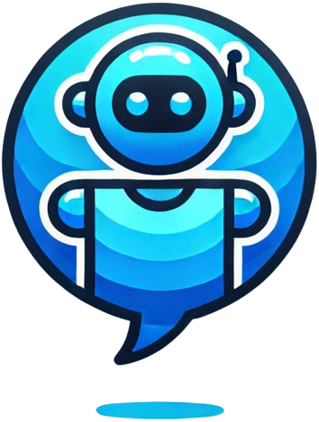

<p align="center">
  
</p>


# chatty-bot
A full stack chat app using OpenAI's API.

## Features
- User authentication
- Chat with OpenAI
- Code generation with OpenAI
- Image upload during chat

## Technologies
- React
- Redux Toolkit
- Node
- Express
- OpenAI
- TailwindCSS
## Installation
1. Clone the repository
1. Run `cd client && npm install`
1. Run `cd server && npm install`
1. Create a `.env.local` file in the `client` directory with the following content:
   ```
   VITE_BASE_URL=http://localhost:1337
   VITE_PROJECT_ID=your_chatengine_project_id_here
   ```
   Replace `your_project_id_here` with your actual project ID.
1. Create a `.env` file in the `server` directory with the following content:
   ```
   PORT=1337
   OPEN_API_KEY=your_openai_api_key_here
   PROJECT_ID=your_chatengine_project_id_here
   PRIVATE_KEY=your_chatengine_private_key_here
   BOT_USER_NAME=your_bot_username_here
   BOT_USER_SECRET=your_bot_user_secret_here
   ```
1. Run `npm run dev`

## Setup ChatBot User
1. Go to https://chatengine.io/projects/your_project_id_here#users
1. Click on `Create a User`
1. Fill in the `username`, `secret` fields and click on `Create User`
1. Copy the `username` and `secret` values into the `.env` file as `BOT_USER_NAME` and `BOT_USER_SECRET`, respectively

## Localhost
- http://localhost:1337/ (optional,server)
- http://localhost:5173/chat
